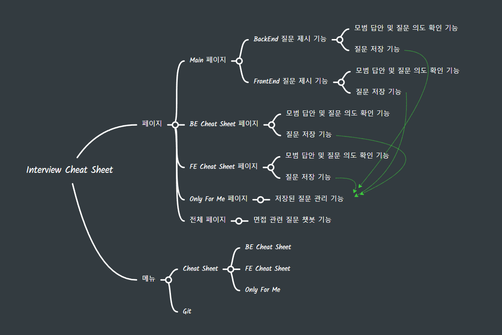

# 신입 개발자 기술 면접 준비 지원 서비스

## 1. 목표와 기능
### 1-1. 목표
- 개발자 준비 과정에서 필요한 기술 모의 면접 지원 플랫폼
### 1-2. 기능
- ChatGpt API를 통한 각 분야별 기술 면접 질문을 제공
- 제공받는 질문을 통해 모의 면접 진행이 가능하며 해당 질문의 의도나 질문에 대한 모범 답을 확인하는 기능까지 제공
## 2. 개발 환경 및 배포 URL
### 2-1. 개발 환경
- JavaScript
### 2-2. 배포 URL
- https://ruler-h.github.io/interviewcheatsheet/
## 3. 프로젝트 구조와 개발 일정
### 3-1. 프로젝트 구조
### 3-2. 개발 일정
## 4. UI/BM
### 4-1. 목업 페이지
- 메인페이지

- 메인페이지 - Chat 화면

- BE Cheat Sheet 페이지

- FE Cheat Sheet 페이지

- Only For Me 페이지

## 5. 기능
### 5-1. 기능 목록

### 5-2. 메인 기능
### 5-3. 추가 기능
## 6. 개발하면서 느낀점
