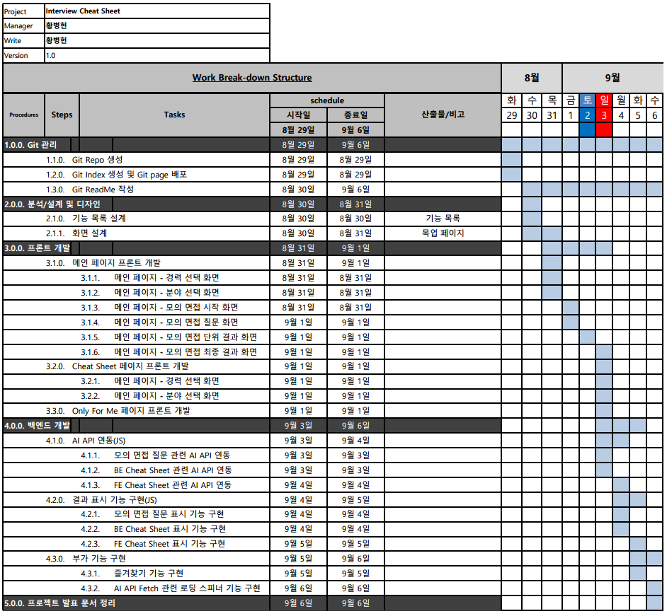

# 개발자 기술 모의 면접 지원 서비스

## 1. 목표와 기능
### 1-1. 목표
- 개발자 준비 과정에서 필요한 기술 모의 면접 지원 플랫폼
### 1-2. 기능
- ChatGpt API를 통한 각 분야별 기술 면접 질문을 제공
- 제공받는 질문을 통해 모의 면접 진행이 가능하며 해당 질문의 의도나 질문에 대한 모범 답을 확인하는 기능까지 제공
## 2. 개발 환경 및 배포 URL
### 2-1. 개발 환경

### 2-2. 배포 URL
- https://ruler-h.github.io/mock_interview/
## 3. 프로젝트 구조와 개발 일정
### 3-1. 프로젝트 구조
	📦mockinterview
 	┣ 📂assets
 	┃ ┣ 📂dist
 	┃ ┃ ┣ 📂css
 	┃ ┃ ┃ ┣ 📜bootstrap.min.css
 	┃ ┃ ┃ ┣ 📜bootstrap.min.css.map
 	┃ ┃ ┃ ┣ 📜bootstrap.rtl.min.css
 	┃ ┃ ┃ ┣ 📜bootstrap.rtl.min.css.map
 	┃ ┃ ┃ ┣ 📜default.css
 	┃ ┃ ┃ ┣ 📜font.css
 	┃ ┃ ┃ ┣ 📜interview-start.css
 	┃ ┃ ┃ ┣ 📜interview.css
 	┃ ┃ ┃ ┣ 📜main.css
	┃ ┃ ┃ ┣ 📜part.css
	┃ ┃ ┃ ┗ 📜reset.css
	┃ ┃ ┣ 📂fonts
	┃ ┃ ┃ ┣ 📜glyphicons-halflings-regular.eot
	┃ ┃ ┃ ┣ 📜glyphicons-halflings-regular.svg
	┃ ┃ ┃ ┣ 📜glyphicons-halflings-regular.ttf
	┃ ┃ ┃ ┣ 📜glyphicons-halflings-regular.woff
	┃ ┃ ┃ ┣ 📜glyphicons-halflings-regular.woff2
	┃ ┃ ┃ ┣ 📜Pretendard-Bold.woff
	┃ ┃ ┃ ┣ 📜Pretendard-Light.woff
	┃ ┃ ┃ ┣ 📜Pretendard-Regular.woff
	┃ ┃ ┃ ┗ 📜Pretendard-SemiBold.woff
	┃ ┃ ┣ 📂images
	┃ ┃ ┃ ┣ 📜empty-star.png
	┃ ┃ ┃ ┣ 📜ormi.jpg
	┃ ┃ ┃ ┗ 📜star.png
	┃ ┃ ┗ 📂js
	┃ ┃ ┃ ┣ 📜bootstrap.bundle.min.js
	┃ ┃ ┃ ┣ 📜bootstrap.bundle.min.js.map
	┃ ┃ ┃ ┗ 📜page.js
	┃ ┣ 📂images
	┃ ┃ ┣ 📜01_main Page.png
	┃ ┃ ┣ 📜02_main Page - after click career.png
	┃ ┃ ┣ 📜03_main Page - after click part.png
	┃ ┃ ┣ 📜04_main Page - Mock Interview.png
	┃ ┃ ┣ 📜05_main Page - after submit answer.png
	┃ ┃ ┣ 📜06_main Page - after click to star.png
	┃ ┃ ┣ 📜07_main Page - Mock Interview - last question.png
	┃ ┃ ┣ 📜08_main Page - after submit answer for last question.png
	┃ ┃ ┣ 📜09_main Page - Mock Interview Result.png
	┃ ┃ ┣ 📜10_BE Cheat Sheet Page 1.png
	┃ ┃ ┣ 📜11_BE Cheat Sheet Page 2.png
	┃ ┃ ┣ 📜12_Only For Me Page.png
	┃ ┃ ┣ 📜function_list_v1.1.png
	┃ ┃ ┗ 📜mock_interview_WBS.png
	┃ ┗ 📂js
	┃ ┃ ┗ 📜color-modes.js
	┣ 📜index.html
	┗ 📜README.md
 
### 3-2. 개발 일정

## 4. UI/BM
### 4-1. 목업 페이지
- 목업 페이지 웹 테스트URL : https://ovenapp.io/view/C3LmQ9sGvyqM28Cg9ZejPeTYKSOK1O5K/5IAOQ
- 메인페이지 - 경력 선택 화면
 

- 메인페이지 - 분야 선택 화면
 

- 모의 면접 시작 화면
 

- 모의 면접 첫 질문 화면
 

- 모의 면접 첫 결과 화면
 

- 모의 면접 첫 결과 즐겨찾기 등록 화면
 

- 모의 면접 마지막 질문 화면
 

- 모의 면접 마지막 질문 결과 화면
 

- 모의 면접 결과 화면
 

- CheatSheet 화면 1
 

- CheatSheet 화면 2
 

- OnlyForMe(즐겨찾기 페이지) 화면
 

## 5. 기능
### 5-1. 기능 목록

### 5-2. 메인 기능
- 모의 면접 기능 
 
	- 제공하는 서비스의 메인 기능인 모의 면접 기능은 사용자의 분야와 경력을 선택하여 선택한 정보에 맞게 면접 질문을 제시해주는 기능입니다.
	- 추가 기능 중 즐겨찾기 기능과도 연계됩니다.

### 5-3. 추가 기능
- 백엔드&프론트엔드 기술 면접 질문 Cheat Sheet 기능 
 
 
	- 기술 면접을 준비하는 입장에서 기술 면접에 나올 질문들을 공부할 수 있는 기능이 필요하다고 생각하여 구현한 기능으로서 BackEnd, FrontEnd를 분할하여 나올 수 있는 질문들을 정리하여 제공하는 기능입니다.
	- 추가 기능 중 즐겨찾기 기능과도 연계됩니다.
- 면접 질문 즐겨찾기 기능 
 
	- 이전 기능들에서 즐겨찾기에 등록한 질문들을 보여주는 기능으로 사용자의 복습을 도와주는 목적으로 만든 기능입니다.
	- 복습 완료한 질문들은 즐겨찾기에서 해제할 수도 있습니다.

## 6. 개발하면서 느낀점
- 오르미 3기 시작 이후 첫 프로젝트이기 때문에 아무래도 잘하고 싶은 마음이 컸던 만큼 아쉬움도 큰 프로젝트였습니다. 당장 구현하는 기능들을 구현하고 나면 구현된 기능과 연계된 기능들이 또 생각나면서 처음에 구현하려 했던 기능들 이외에도 더 구현하고 싶은 기능들이 계속해서 생겨났습니다.
- 물론 그 기능들을 다 구현하지는 못했지만, 프로젝트 과정 중 우선순위는 기능이 많은 것보다 필요한 기능들이 다 구현되는 것에 있다는 것을 깨닫고 이를 되새기며 서비스를 구현했습니다.
- 차후에 서비스를 고도화할 기회가 있다면 서버와의 연동이나 모의 면접의 추가적인 보완을 통해 서비스 품질을 높일 것을 기대하고 있습니다.